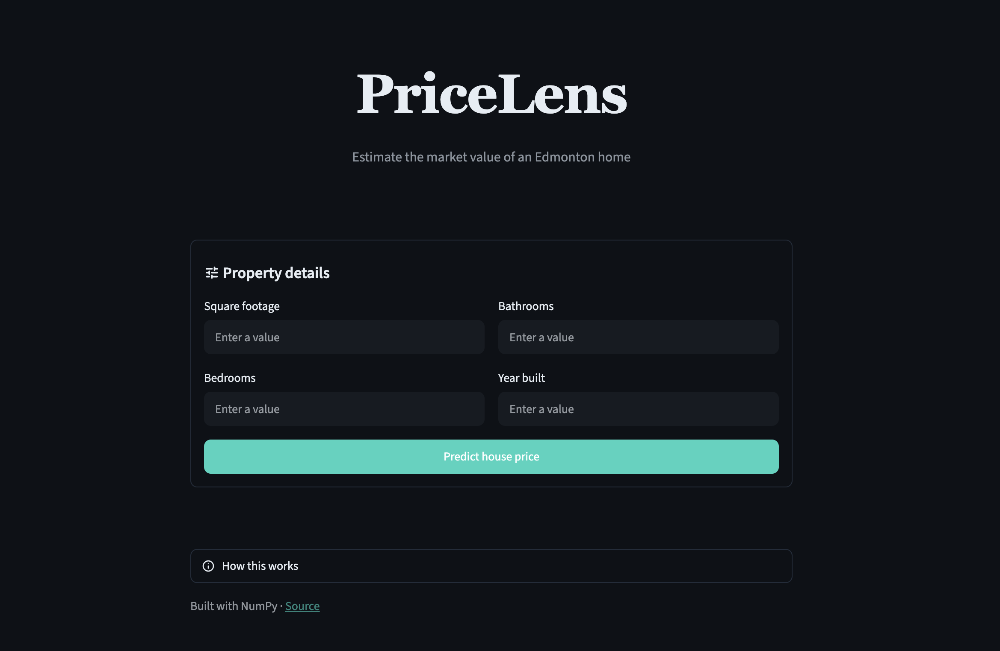

# PriceLens


Estimate the market value of an Edmonton home from its size, layout and age.

https://pricelens.streamlit.app



## Features

- Price estimates from four inputs: size, bedrooms, bathrooms, year built
- A user-friendly Streamlit interface for quick estimates.
- Input bounds match the training data range
- Model parameters saved after training, so predictions are instant

## Tech stack

- **Frontend:** Streamlit
- **Backend:** Python
- **Data Processing:** pandas, NumPy
- **Training Diagnostics:** Matplotlib

## Run locally

```bash
git clone https://github.com/lxeu/PriceLens.git
cd PriceLens
pip install -r requirements.txt
streamlit run app.py
```

To retrain the model from the raw data:

```bash
python src/train.py
```

## Related

The model is developed in
[edmonton-housing-price-predictor](https://github.com/lxeu/edmonton-housing-price-predictor).
I started from a single-variable regression and built up to the multivariable model used here.

## Roadmap

- Neighbourhood as a feature
- Vectorized gradient descent
- Half baths and garages as features
